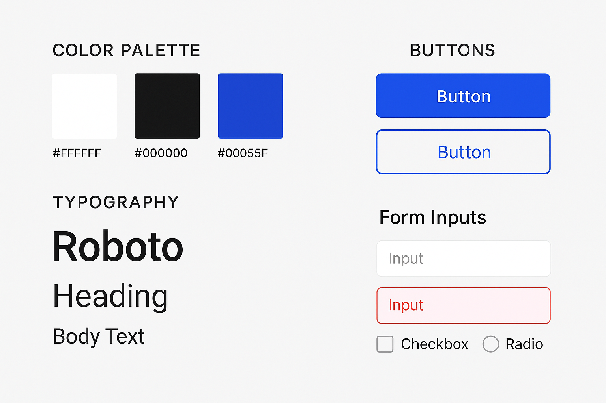

# 🧑‍🎨 Style Guide - Projeto de Estudo

Este repositório contém um style guide básico para projetos de front-end, ideal para iniciantes.

## 🎯 Objetivo

Fornecer uma base visual simples e reutilizável com:

- Paleta de cores
- Tipografia
- Botões
- Campos de formulário

## 🧰 Tecnologias utilizadas

- Figma (para o design visual)
- Markdown (documentação)
- Google Fonts (Roboto)

## 📷 Exemplo visual

## 🎨 Cores utilizadas

- Branco: `#FFFFFF`
- Preto: `#000000`
- Azul: `#0055FF`

## 🔤 Tipografia

- Fonte: [Roboto](https://fonts.google.com/specimen/Roboto)

## 🧪 Sugestão

Sinta-se à vontade para adaptar ou expandir conforme for evoluindo nos estudos!
